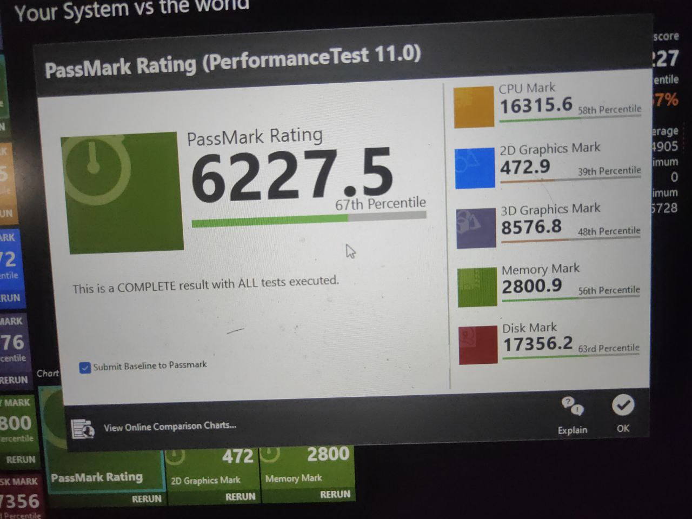
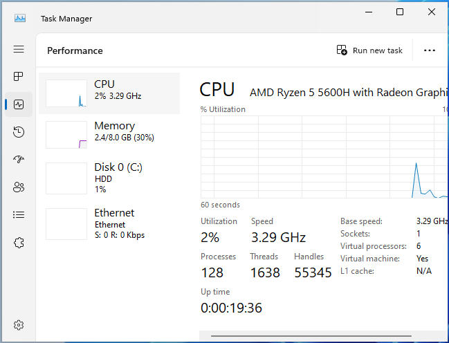

# 🔮 Optimize Windows
[]() &nbsp;

 - This repository contains an Answer File designed to optimize and streamline your Windows installation, making it perfect for gaming, power users, and even low-end laptops or PCs. 🎮💻
 - For existing Windows and if you don't want to reinstall then it's recommended to use [WinUtil by CTT.](https://github.com/ChrisTitusTech/winutil)

## 📑 Table of Contents

- [📂 Included Script](#-included-script)
- [🚀 Features](#-features)
- [🔧 Installation](#-installation)
- [📸 Screenshots](#-screenshots)
- [💖 Acknowledgements](#-acknowledgements)

## 📂 Included Script
### Auto Unattend or Answer File

 - Automates Windows installation with optimized settings, debloating or tweaking Windows etc.
 - Ideal for new setups or reinstalling Windows.

## 🚀 Features
### 1. **🚀 While Installation of Windows***
- 🚧 Bypass Windows 11 Requirements
- 🌐 Support for Local Account During Setup
- 🗂️ Show All Available Windows Editions
- 💾 Support Automatic Offline Driver Installation
- ⚙️ Auto OOBE Setup
- 🚀 Improve Windows Installation Speed

### 2. **💨 Debloat & Optimization**
- 🧹 Remove Windows Bloatware
- ❌ Disable Error Reporting, Delivery Optimization, and Remote Assistance
- 🚀 Various Services Optimization
- 🚫 Disable Automatic File Discovery
- 🎮 Turn on Game Mode & GPU Scheduling

### 3. **🔐 Privacy & Security**
- 👁️ Disable Telemetry and Tracking
- 🔔 Display Camera On/Off Notification
- 🔒 Configure Windows Update: Security-Only Updates, Delay Feature Updates by 1 Year
- 🔒 Prevent Installation of Dev Home, New Outlook, Chat, Bitlocker Auto-Encryption

### 4. **👤 User-Based Customizations**
- 📁 Hide Gallery and Network Navigation (In Explorer)
- 🔄 Hide Removable Drives (In Explorer)
- ⚙️ Hide Homepage(In Settings)
- 🛡️Hide Unused Security Pages(In Windows Security)
- 📊 Show More Details on File Transfer
- 🖥️ Enable Verbose Status Messages
- 🔤 Use Full App Name on Desktop Shortcuts

### 5. **🛑 Disable Components/Services**
- 💤 Disable Hibernation and Reserved Storage
- 🖨️ Disable Printer Spooler
- 🔍 Disable Search Indexing
- 🛡️ Fully Disable Windows Defender

### 6. **📂 Shivaay's Folder Options**
#### 🔐 **Security**
- 🛡️ Toggle Windows Defender, Core Isolation, Unused Security Pages and Fault Torrent Heap

#### 📦 **Software**
- 🎮 Install Game Bar (Without Xbox Bloats)

#### 🛠️ **System Management**
- 💤 Toggle Hibernation, Fast Startup
- 🖨️ Toggle Printer Spooler
- 📵 Toggle Notifications and Background Apps
- 🔍 Toggle Search Indexing
- 🎥 Toggle GameDVR

#### ⚡ **Optimizations**
- 🔔 Toggle Update Notification
- 🔄 Toggle File Discovery, 8.3 Char Name, Last Access Time, Multi-Plane Overlay

#### 🖥️ **User Interface**
- 📁 Toggle Gallery, Network Pane and Removable Drives in File Explorer
- 📝 Change Default New Folder Name
- 📜 Toggle Recent Items (Recent Apps, Recent Documents, Files etc)
- 🔄 Toggle Windows Old/New Context Menu

### 7. **🔄 Miscellaneous**
- 🖥️ Create Shortcuts on Desktop of CTT Winutil and Activate Windows.
- ⚡ Added a Custom Power Plan (Shivaay - Power Within)
- 🌑 Don't Dim Windows while User Account Control
- 🛑 Disable Auto Restart on BSOD (To Capture Detailed Logs)

## 🔧 Installation

### 1. Prepare Your USB Drive
1. Create a bootable USB drive using **Ventoy**.
2. [Download the Optimize-Windows.zip](https://github.com/ShivamXD6/Optimize-Windows/blob/main/Optimize-Windows.zip).
3. Extract the contents of `Optimize-Windows.zip` into your USB drive.
4. Confirm that the file structure on your USB drive matches the following:

    ```plaintext
    D: (Your USB Drive)
    │
    ├───$WinpeDriver$
    │   └───Add or Export Your Drivers Here
    │
    ├───ventoy
    │   │───ventoy.json
    │   └───autounattend.xml
    │
    └───WinISO
        └───Add Your Windows ISO Here
    ```

5. Add your Windows ISO into WinISO, then Move on to Next Section.

### 2. Optional: Adding Drivers
1. Create a folder named `Drivers` on your C: drive.
2. Backup your current Windows drivers to the C: drive by running the command in command prompt as administrator:

    ```cmd
    dism /online /export-driver /destination:C:\Drivers
    ```

3. Plug your USB drive/installation media into your computer.
4. Copy the drivers you want to automatically install from `C:\Drivers` to `D:\$WinpeDriver$`.

> [!NOTE]
> Drivers should be placed in their respective subfolders with `.inf` files included. `.exe` driver files are not supported.

### 3. Installing Windows via Ventoy
1. Now Restart into Boot Selection Menu (By Pressing F12, F8 or ESC Repeatedly).
2. Select your USB Drive.
3. If it Says "Verification Failed: (0x1A) Security Violation" Then, Follow this :-


4. Now Select `Boot in Normal Mode`.
5. Now you'll see some commands running.
6. Select Your Language, Region and Windows Version.

> [!NOTE]
> If you don't see many windows version. Click back once and again next then you will get all Windows Versions.

7. You'll be Redirected to Custom Installation. Now Do any one method according to your condition.

-  If you want to keep your data :- Just select partition where your windows is installed and click next. Don't delete any other partition.

- If you want to Clean Install :- Delete all partitions. Then select Unallocated Space and click Next.

8. Enter your Name and Password for Local User Account (Use Simple names without Symbols).
9. Now windows will run some more commands and restart.
10. Done Enjoy :).

## 📸 Screenshots

### 🧪 Benchmarks

- On Original Windows



- On Windows with Answer File


### 💻 Process Count and RAM Usage

- On Original Windows



- On Windows with Answer File


### 🖥️ Desktop & Shivaay Folder

- On Original Windows


- On Windows with Answer File


## 💖 Acknowledgements
 - Thanks to [MemTechTips](https://github.com/memstechtips/UnattendedWinstall) for Core file Used as a base for Answer File.
 - Credits to [Atlas](https://atlasos.net), [ChrisTitusTech](https://github.com/ChrisTitusTech/winutil) and [Revi](https://revi.cc) for Tweaks used in this answer File.
